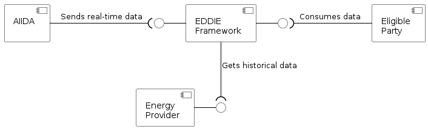

# System Scope and Context
<!-- System scope and context - as the name suggests - delimits your system
(i.e. your scope) from all its communication partners (neighboring
systems and users, i.e. the context of your system). It thereby
specifies the external interfaces. If necessary, differentiate the 
business context (domain specific inputs and outputs) from the 
technical context (channels, protocols, hardware).

Various options:
-   Context diagrams
-   Lists of communication partners and their interfaces. -->

The context of the system is described by showing the external interfaces and by specifying inputs and outputs. We differentiate between business context and technical context (for the same system).

## Business Context

<!-- All kinds of diagrams that show the system as a black box and specify
the domain interfaces to communication partners. Alternatively 
(or additionally) you can use a table, the three columns contain the name of
the communication partner, the inputs, and the outputs. -->

From a business perspective, our system consists of four components and three interfaces which are shown in the figure below. 

As shown in the figure, the four components of the system are:
1. AIIDA (Administrative Interface for In-house Data Access)
1. Energy provider (implements one interface for communication with the EDDIE framework)
1. EDDIE framework (implements two interfaces for communication with AIIDA and the energy provider)
1. Eligible party 

A description of the components is shown in the table below.

| Component | Description | Within Scope |
|-|-|-|
| AIIDA | Aggregates real-time data from an energy metering device (e.g., a smart meter or an IoT home automation system), and sends this data to the EDDIE framework. | &#x2611; Yes | 
| Energy provider | Provides historical data about the energy consumption of an energy consumer (e.g., energy consumption within a house). | &#x2612; No|
| EDDIE framework | Aggregates energy data from AIIDA and the energy provider (can be multiple instances of AIIDA and energy providers), and consolidates it. | &#x2611; Yes |
| Eligible party | Acquires consolidated data from the EDDIE framework and uses it to generate value, e.g., using data analysis services that are based on statistics, machine learning, and artificial intelligence approaches. | &#x2612; No |

The figure above shows how an eligible party can acquire real-time data (from AIIDA) and historical data (from the energy provider) using the EDDIE framework. The eligible party is then expected to process this data using services (as discussed in quality goal No. 2 mentioned in Section [Introduction and Goals](../1-introduction-and-goals/)). Interestingly, an energy provider can also act as an eligible party that aggregates energy data and processes it using the existing services. This way, a consumer can use services that are offered by any energy provider in the same or different country (as discussed in quality goal No. 2 mentioned in Section [Introduction and Goals](../1-introduction-and-goals/)).

Notably, **one eligible party must be able to use one instance of an EDDIE framework to communicate with one or more instances of AIIDA and energy providers**. This way, the eligible party can aggregate data from multiple consumers thereby being able to implement services that leverage large datasets of energy information (i.e., not only from one consumer).

## Technical Context 

<!-- Technical interfaces (channels and transmission media) linking your
system to its environment. In addition a mapping of domain specific
input/output to the channels, i.e. an explanation which I/O uses which
channel.

Many stakeholders make architectural decision based on the technical
interfaces between the system and its context. Especially infrastructure
or hardware designers decide these technical interfaces.

E.g. UML deployment diagram describing channels to neighboring systems,
together with a mapping table showing the relationships between channels
and input/output. -->
