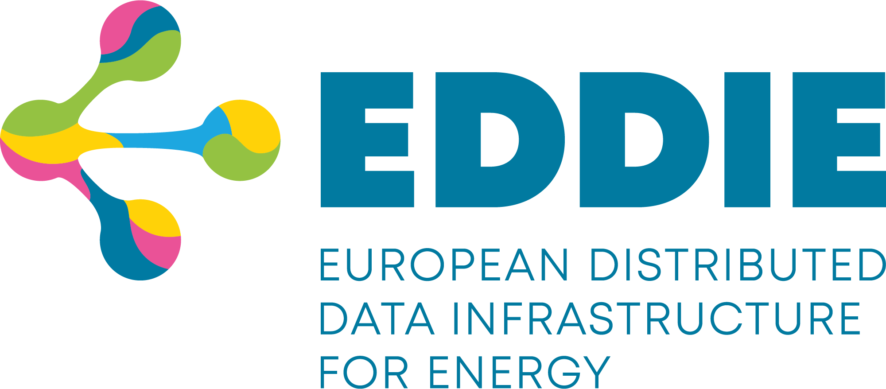

 
 

# EDDIE Architecture

This repository hosts the software architecture of EDDIE (European Distributed Data Infrastructure for Energy) which has been documented based on [acr42](https://arc42.org/). EDDIE is a research project co-funded by the European Union's Horizon Innovation Actions under grant agreement No. 101069510. For the details of the architecture, please check the links below.

1. [Introduction and goals](./1-introduction-and-goals/)

1. [Constraints](./2-constraints/)

1. [Context & Scope](./3-context-and-scope/)

1. [Solution Strategy](./4-solution-strategy/)

1. [Building Block View](./5-building-block-view/)

1. [Runtime View](./6-runtime-view/)

1. [Deployment View](./7-deployment-view/)

1. [Crosscut Concepts](./8-crosscut-concepts/)

1. [Architectural Decisions](./9-architectural-decisions/)

1. [Quality Requirements](./10-quality-requirements/)

1. [Risks & Technical Debt](./11-risks-and-technical-debt/)

1. [Glossary](./12-glossary/)

#

## Other Interesting links:

- [EDDIE Website](https://eddie.energy/)
- [EDDIE Linkedin](https://www.linkedin.com/company/eddie-energy/)
- EDDIE Software Development (pending)

